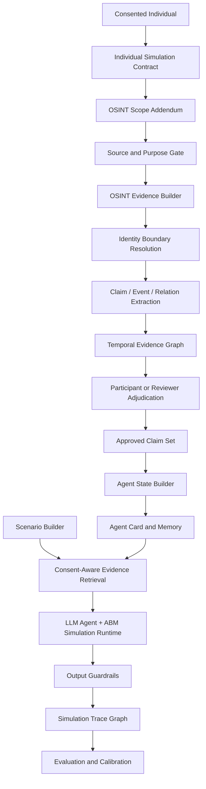
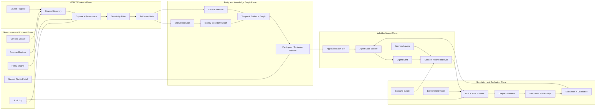
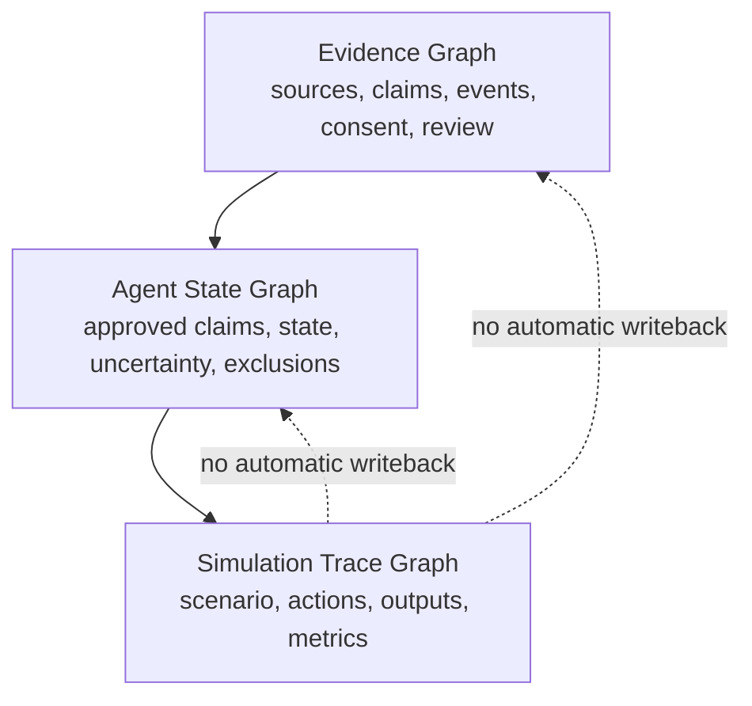
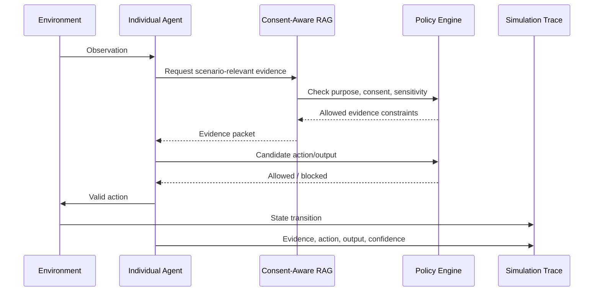

# Orb

**Architecture manuscript**  
**Version:** 0.1  
**Date:** 2026-05-07  
**Status:** Conceptual architecture draft  
**Primary audience:** founders, product architects, research leads, data/AI governance leads, simulation engineers  
**Scope:** Detailed end-to-end architecture from consented OSINT evidence to evidence-constrained individual and multi-agent simulation  
**Important note:** This document is an architecture and product-design document, not legal advice. Legal review is required before deployment in any regulated jurisdiction or high-impact use case.

---

## Table of Contents

1. [Executive Summary](#1-executive-summary)
2. [Design Thesis](#2-design-thesis)
3. [Reference Research and Regulatory Context](#3-reference-research-and-regulatory-context)
4. [Core Definitions](#4-core-definitions)
5. [Design Goals and Non-Goals](#5-design-goals-and-non-goals)
6. [Top-Level Architecture](#6-top-level-architecture)
7. [End-to-End Lifecycle: From OSINT to Simulation](#7-end-to-end-lifecycle-from-osint-to-simulation)
8. [Architecture Plane A: Governance and Consent](#8-architecture-plane-a-governance-and-consent)
9. [Architecture Plane B: OSINT Evidence](#9-architecture-plane-b-osint-evidence)
10. [Architecture Plane C: Entity and Knowledge Graph](#10-architecture-plane-c-entity-and-knowledge-graph)
11. [Architecture Plane D: Individual Agent](#11-architecture-plane-d-individual-agent)
12. [Architecture Plane E: Simulation and Evaluation](#12-architecture-plane-e-simulation-and-evaluation)
13. [Core Data Assets](#13-core-data-assets)
14. [Three-Graph Model](#14-three-graph-model)
15. [Control Loops](#15-control-loops)
16. [Operating Modes](#16-operating-modes)
17. [Trust Boundaries and Safety Controls](#17-trust-boundaries-and-safety-controls)
18. [Evaluation and Calibration Framework](#18-evaluation-and-calibration-framework)
19. [Recommended MVP Roadmap](#19-recommended-mvp-roadmap)
20. [Example End-to-End Scenario](#20-example-end-to-end-scenario)
21. [Appendix A: Canonical Object Models](#appendix-a-canonical-object-models)
22. [Appendix B: Architecture Diagrams](#appendix-b-architecture-diagrams)
23. [Appendix C: Governance Checklist](#appendix-c-governance-checklist)
24. [Appendix D: References](#appendix-d-references)

---

# 1. Executive Summary

This document describes **Orb**: a consented OSINT-grounded individual simulation platform that uses explicitly authorized individual data, approved open-source intelligence (OSINT), evidence graphs, entity resolution, and LLM/agent-based simulation to model how real individuals may respond under defined scenarios.

The platform is not a generic “type a name and simulate anyone” OSINT product. It is a **consent-first, evidence-constrained, audit-ready simulation infrastructure** for a bounded group of individuals who have provided prior authorization. OSINT is used to ground the agent, not to secretly reconstruct the person.

The central architectural claim is:

> **OSINT provides grounding. The knowledge graph defines the truth boundary. The individual agent generates scenario-specific behavior hypotheses. The simulation trace makes the process auditable and calibratable.**

The system should be built around five architecture planes:

1. **Governance and Consent Plane**  
   Defines who may be modeled, for what purpose, with what data, under what constraints, with what review and withdrawal rights.

2. **OSINT Evidence Plane**  
   Converts approved open-source data into traceable evidence units with provenance, source metadata, sensitivity labels, and retention controls.

3. **Entity and Knowledge Graph Plane**  
   Resolves identity boundaries conservatively, extracts claims/events/relations, and stores them as a temporal evidence graph.

4. **Individual Agent Plane**  
   Converts approved evidence into structured agent state, agent cards, memory layers, uncertainty maps, and consent-aware evidence packets.

5. **Simulation and Evaluation Plane**  
   Executes individual, group, and network simulations using LLM agents plus ABM-style environment logic, then records simulation traces, outputs confidence estimates, and supports validation.

The most important design constraint is that **simulation outputs must never automatically become facts about the real person**. They belong in a separate simulation trace graph and can only be used for review, calibration, and scenario analysis.

---

# 2. Design Thesis

Most adjacent systems solve only part of the problem:

- OSINT and investigative graph tools help analysts discover entities, accounts, relations, and events.
- Entity resolution systems help merge fragmented identities.
- Knowledge graphs provide structured evidence and relationship context.
- LLM agents simulate behavior using memory, reflection, planning, and role-based reasoning.
- Agent-based models simulate emergent social dynamics over time.

The proposed platform connects these into a closed loop:

```text
Consent
  → OSINT source governance
  → Evidence capture
  → Entity boundary resolution
  → Claim/event/relation extraction
  → Temporal evidence graph
  → Participant/reviewer adjudication
  → Agent state synthesis
  → Scenario/environment modeling
  → LLM + ABM simulation
  → Evidence-grounded output
  → Simulation trace
  → Evaluation and calibration
```

The platform should not be optimized for maximum data collection. It should be optimized for:

- **Authorized use**
- **Source traceability**
- **Conservative identity linking**
- **Evidence-grounded agent state**
- **Clear uncertainty**
- **Non-impersonation**
- **Auditability**
- **Evaluation and calibration**

The core architecture pattern is:

```text
Do not turn OSINT directly into an agent.
Turn OSINT into evidence.
Turn evidence into approved claims.
Turn approved claims into bounded agent state.
Turn bounded agent state into scenario-specific simulated responses.
Keep every step reversible, reviewable, and auditable.
```

---

# 3. Reference Research and Regulatory Context

This architecture is informed by three research streams.

First, **generative agents** research shows that LLM agents can produce believable individual and social behavior when they maintain memory, synthesize reflection, retrieve relevant context, and plan actions. The Stanford/Google “Generative Agents” paper describes agents that store experiences in natural language, synthesize memories into higher-level reflections, and retrieve memories dynamically to plan behavior.[^gen-agents]

Second, **individual simulation** research has started to test person-specific agents grounded in self-reports. A 2024 paper on LLM agents grounded in self-reports used interviews and surveys from 1,052 participants and reported that agents achieved 83%–86% of participants’ two-week test-retest consistency on held-out General Social Survey items, depending on input modality.[^self-reports]

Third, **social simulation with LLM agents** has emerged as a broader field. A 2024 survey categorizes LLM-agent social simulation into individual simulation, scenario simulation, and society simulation; this progression maps well to a platform that starts with authorized individual agents and later expands to group and network simulations.[^social-survey] Other systems such as Concordia, AgentSociety, and OASIS provide reference patterns for generative social simulation, large-scale social environments, and social media-style interaction models.[^concordia][^agentsociety][^oasis]

The architecture is also shaped by privacy and AI governance constraints. For example:

- The NIST AI Risk Management Framework organizes AI risk management through Govern, Map, Measure, and Manage functions.[^nist-rmf]
- GDPR Article 5 sets principles such as lawfulness, fairness, transparency, purpose limitation, data minimization, accuracy, storage limitation, integrity/confidentiality, and accountability.[^gdpr-5]
- GDPR Article 9 treats certain personal data categories, such as political opinions, health, biometric identification, racial or ethnic origin, religious beliefs, trade union membership, sex life, and sexual orientation, as special categories requiring stronger protection.[^gdpr-9]
- GDPR Article 22 restricts solely automated decisions, including profiling, that produce legal or similarly significant effects.[^gdpr-22]
- GDPR Article 35 requires a data protection impact assessment where new technology or processing is likely to create high risk for individuals’ rights and freedoms.[^gdpr-35]
- The EU AI Act entered into force on 1 August 2024 and phases in obligations over time; the European Commission states that prohibited AI practices and AI literacy obligations applied from 2 February 2025, governance and GPAI obligations from 2 August 2025, many high-risk and transparency obligations from 2 August 2026, and product-embedded high-risk obligations from 2 August 2027.[^eu-ai-act]
- The Australian OAIC has warned that publicly accessible data is not automatically free to use for developing or training generative AI systems and that privacy obligations still apply when personal information is involved.[^oaic-genai]

This document intentionally treats the platform as a high-governance AI/data product because it combines OSINT, personal data, entity resolution, profiling-like modeling, and individual-level simulation.

---

# 4. Core Definitions

## 4.1 OSINT-Grounded Individual Agent

An **OSINT-grounded individual agent** is an evidence-constrained simulation model associated with a real, consented individual. It uses authorized self-provided data, approved public evidence, and reviewed claims to generate scenario-specific behavior hypotheses.

It is not the real person. It must not claim to speak for the real person. It must not impersonate the person.

## 4.2 Consented Individual

A **consented individual** is a real person who has explicitly authorized the platform to use specified categories of data, including specified OSINT source types, for specified simulation purposes.

Consent should be operationalized as a machine-readable policy object, not merely stored as a PDF or checkbox.

## 4.3 OSINT Scope

**OSINT scope** defines which public sources may be used, over what period, for which purposes, with which excluded categories, and under which review conditions.

Examples:

- Self-authored public posts
- Public professional profiles
- Public talks and interviews
- Publications
- Official organization pages
- Public event participation records

Excluded examples:

- Leaked data
- Doxxing databases
- Private or closed groups
- Data behind authentication without permission
- Unverified gossip
- Biometric face scraping
- Sensitive inferences outside authorization

## 4.4 Evidence Unit

An **evidence unit** is a captured, normalized piece of source material with provenance metadata.

It is not yet an agent memory.

## 4.5 Claim

A **claim** is a structured statement derived from evidence.

Examples:

```text
Person P authored public article A on date D.
Person P publicly discussed topic T in source S.
Person P attended event E.
Person P is affiliated with organization O.
```

Claims must record source, confidence, time, consent scope, review status, and sensitivity.

## 4.6 Agent State

**Agent state** is the bounded, approved, simulation-usable representation of the individual. It is synthesized from approved claims and authorized self-reports.

Agent state should distinguish:

- Confirmed facts
- Self-reported preferences
- Publicly evidenced positions
- Contextual background
- Weak hypotheses
- Excluded or do-not-use knowledge

## 4.7 Simulation Trace

A **simulation trace** is a record of one simulation run: scenario inputs, evidence packets, retrieved claims, excluded claims, agent observations, candidate actions, blocked actions, generated outputs, confidence scores, environment transitions, and review decisions.

Simulation traces are not facts about the person.

## 4.8 Third-Party Subject

A **third-party subject** is a real person who appears in evidence, relations, communications, network context, or simulation output but is not the consented individual being modeled.

Third-party subjects require their own minimization and protection rules. Their mentions should be redacted, generalized, pseudonymized, or excluded unless there is a specific lawful basis, explicit authorization, or a clear necessity for the approved purpose.

The system should not silently convert third-party mentions into graph nodes that can be profiled, ranked, targeted, or simulated.

---

# 5. Design Goals and Non-Goals

## 5.1 Design Goals

### Consent-first modeling

The platform must only create individual agents for people who are in scope and authorized. Consent, purpose, source permissions, and output restrictions must be enforced before data collection, modeling, retrieval, simulation, and output.

### Evidence-grounded simulation

Every substantive agent output should be traceable to authorized evidence, self-reports, scenario assumptions, or explicitly marked uncertainty.

### Conservative entity resolution

The platform should default to “not merged” unless identity links are confirmed or sufficiently reviewed. Candidate links should not automatically enter agent memory.

### Temporal modeling

Public positions, relationships, roles, and events change over time. The platform must preserve observed time, publication time, capture time, verification time, and expiration time.

### Simulation-only reasoning

Agent reasoning and simulated behavior should remain in the simulation trace. It should not update the real person’s evidence graph unless separately validated and reviewed.

### Hybrid simulation

LLM agents should handle semantic reasoning, dialogue, scenario interpretation, and behavioral hypotheses. ABM-style simulation logic should handle time, network propagation, environment state, resource constraints, and repeatable experiments.

### Auditable operation

Every run should answer:

```text
Who authorized this?
What purpose was approved?
What evidence was used?
What evidence was excluded?
What did the agent output?
What confidence was assigned?
Who reviewed it?
Could the subject contest or delete it?
```

### Third-party minimization

The platform must protect people who appear in source material but did not authorize modeling. Third-party names, handles, relationships, and network positions should be minimized before claim extraction, graph storage, retrieval, simulation, and output.

### Revocable derived artifacts

Consent withdrawal, correction, and source deletion must propagate beyond raw evidence. Derived claims, agent cards, evidence packets, embeddings, vector indexes, simulation traces, evaluation reports, exports, and backups need explicit retention and deletion behavior.

## 5.2 Non-Goals

The platform should not be designed to:

- Simulate arbitrary people without authorization.
- Generate impersonation content that appears to come from the person.
- Predict a real person’s future behavior as a deterministic fact.
- Infer sensitive attributes without explicit authorization and strong necessity.
- Produce automated high-impact decisions about employment, credit, insurance, education, law enforcement, discipline, or similar matters.
- Use leaked data, doxxing sources, private groups, or access-controlled content without permission.
- Scrape the open web indiscriminately and then backfill consent later.
- Treat public availability as sufficient legal or ethical basis for individual modeling.
- Convert simulation outputs into permanent person profile facts.
- Rank real individuals as key nodes, influence targets, vulnerability targets, or intervention targets.
- Build segmentation or targeting infrastructure for persuasion, manipulation, employment, insurance, credit, law enforcement, discipline, or similar individual-impact use.

---

# 6. Top-Level Architecture

The system is organized into five planes.

```text
┌────────────────────────────────────────────────────────────────────┐
│ A. Governance and Consent Plane                                    │
│ Consent, purpose, policy, risk, audit, subject rights, retention    │
└────────────────────────────────────────────────────────────────────┘
                               │
                               v
┌────────────────────────────────────────────────────────────────────┐
│ B. OSINT Evidence Plane                                            │
│ Source registry, scoped capture, provenance, sensitivity filtering  │
└────────────────────────────────────────────────────────────────────┘
                               │
                               v
┌────────────────────────────────────────────────────────────────────┐
│ C. Entity and Knowledge Graph Plane                                │
│ Identity boundary, entity resolution, claims, events, temporal KG   │
└────────────────────────────────────────────────────────────────────┘
                               │
                               v
┌────────────────────────────────────────────────────────────────────┐
│ D. Individual Agent Plane                                          │
│ Agent cards, agent state, consent-aware RAG, memory, uncertainty    │
└────────────────────────────────────────────────────────────────────┘
                               │
                               v
┌────────────────────────────────────────────────────────────────────┐
│ E. Simulation and Evaluation Plane                                 │
│ Scenarios, environment, LLM agents + ABM, traces, validation        │
└────────────────────────────────────────────────────────────────────┘
```

The Governance and Consent Plane is cross-cutting. It is not merely an onboarding module. It must intercept:

- Source discovery
- OSINT capture
- Entity association
- Claim extraction
- Claim approval
- Agent state synthesis
- Retrieval
- Simulation execution
- Output rendering
- Export
- Deletion
- Calibration

In implementation, these checks should be enforced as policy-as-code, not as prompt instructions alone. Every allow, deny, redact, aggregate-only, or review-required decision should produce a machine-readable policy decision with the applicable rule, evidence, actor, purpose, and timestamp.

A simplified end-to-end view:



---

# 7. End-to-End Lifecycle: From OSINT to Simulation

The lifecycle has thirteen phases.

## Phase 0: Use-Case and Consent Framing

Before collecting OSINT, the system defines:

- Who is being modeled.
- Why they are being modeled.
- What simulation purposes are allowed.
- What source categories are allowed.
- Which source categories are excluded.
- Whether individual-level outputs are allowed.
- Whether only aggregate outputs are allowed.
- Who can view outputs.
- How long data may be retained.
- What withdrawal and correction rights apply.
- How third-party subjects will be minimized or protected.
- How derived artifacts will be deleted or retained after withdrawal.
- Whether the use case could affect rights, opportunities, treatment, reputation, or safety.

Primary output:

```text
Individual Simulation Contract
OSINT Scope Addendum
Risk Classification
Approved Use Case
Prohibited Use Case List
Subject Rights Policy
Retention Policy
Third-Party Data Handling Policy
Derived Artifact Deletion Policy
```

The design principle is:

```text
No scope, no collection.
No purpose, no modeling.
No evidence, no claim.
No review, no agent state.
No audit, no simulation.
```

## Phase 1: OSINT Source Governance

The platform maintains a source registry that classifies approved and excluded OSINT sources.

Example categories:

```text
Allowed:
- Self-confirmed public accounts
- Self-authored public posts
- Public professional profiles
- Public talks and interviews
- Publications and reports
- Official organization pages
- Public event participation records

Restricted:
- Third-party media mentions
- Public comments by others about the individual
- Public forum references
- Aggregated databases

Excluded:
- Leaked data
- Private/closed groups
- Data behind login without permission
- Doxxing databases
- Unverified gossip
- Sensitive inference sources
- Biometric face scraping
```

Each source type has metadata:

```text
source_type
collection_allowed
review_required
sensitivity_default
retention_default
license_or_terms_status
usable_for_individual_output
usable_for_aggregate_output
third_party_handling
embedding_allowed
```

## Phase 2: OSINT Ingestion and Provenance

The system captures source material as evidence, not as agent memory.

The ingestion pipeline:

```text
Source discovery
  → scope check
  → access and terms check
  → capture
  → metadata extraction
  → content hashing
  → provenance registration
  → sensitivity prefilter
  → evidence unit creation
```

Every evidence unit records:

```text
source_id
source_type
captured_at
observed_at
published_at
publisher
author
capture_method
content_hash
consent_scope_id
license_status
terms_status
sensitivity_label
third_party_subjects_detected
third_party_minimization_status
person_link_confidence
review_status
retention_policy
derived_artifact_policy
```

## Phase 3: Identity Boundary and Entity Resolution

The system determines whether a source, account, event, organization, or public statement belongs to the consented person.

Entity association is represented as a graded boundary:

```text
confirmed
likely
possible
disputed
rejected
```

Only confirmed or explicitly approved associations should be eligible for agent state.

Conservative rule:

```text
Automated similarity can create candidate links.
It cannot create confirmed identity links without evidence or review.
```

Identity boundary outputs:

```text
Verified Person Node
Confirmed Account Nodes
Candidate Account Nodes
Rejected Account Nodes
Confirmed Organization Links
Candidate Event Links
Disputed Links
```

## Phase 4: Claim, Event, and Relation Extraction

The system converts evidence into structured candidates.

Extraction targets:

```text
Claims:
- Person authored source
- Person discussed topic
- Person expressed position
- Person has public role
- Person attended event

Events:
- who
- did what
- when
- where
- through which channel
- with what evidence

Relations:
- person ↔ account
- person ↔ organization
- person ↔ topic
- person ↔ event
- person ↔ other person
- claim ↔ source
- claim ↔ consent scope
```

The extraction layer must distinguish:

```text
Observed fact ≠ inference
Self-authored statement ≠ third-party attribution
Public professional context ≠ private life
Historical position ≠ current intent
Scenario response ≠ real-world belief
Mentioned third party ≠ consented participant
Relationship evidence ≠ permission to profile the relationship target
```

## Phase 5: Temporal Evidence Graph Construction

Approved and candidate evidence becomes a temporal graph.

Temporal fields:

```text
observed_at
published_at
captured_at
verified_at
valid_from
valid_until
decayed_weight
```

Graph elements:

```text
Person
Account
Source
Claim
Event
Organization
Topic
Location
ConsentScope
ReviewDecision
ThirdPartySubject
```

Edges:

```text
authored
mentioned_in
attended
affiliated_with
supported_by
contradicted_by
within_scope_of
derived_from
reviewed_by
expires_at
```

The temporal graph prevents stale public data from being treated as current reality.

## Phase 6: Participant or Reviewer Adjudication

Because individuals are pre-authorized, the system should use participant review as a product feature, not an afterthought.

Review questions:

```text
Is this you?
Is this accurate?
Is this out of date?
Can this be used for the approved purpose?
Can this be used for individual outputs?
Can this only be used for aggregate outputs?
Is this sensitive?
Does this expose a third party?
Should third-party names or relations be redacted?
Should this be excluded?
```

Review outputs:

```text
Approved Claim Set
Disputed Evidence Queue
Rejected Evidence Archive
Agent-Usable Evidence Set
```

Rule:

```text
Unreviewed OSINT may support discovery.
It should not directly drive individual-agent behavioral simulation.
```

## Phase 7: Individual Agent State Builder

The Agent State Builder transforms approved claims into simulation-usable state.

Agent state includes:

```text
identity boundary
authorized purposes
known public roles
relevant relationships
public positions
communication style
decision constraints
topic familiarity
likely concerns
uncertainty map
excluded topics
sensitive-data restrictions
evidence references
```

State layers:

```text
Layer 1: Confirmed facts
Layer 2: Self-reported preferences
Layer 3: Publicly evidenced positions
Layer 4: Contextual background
Layer 5: Weak hypotheses
Layer 6: Excluded or do-not-use knowledge
```

The state builder should never produce an unrestricted “profile blob.” It should produce a structured **Agent Card**.

## Phase 8: Agent Memory Architecture

Memory is separated into four layers.

```text
Evidence Memory
- Approved claims and self-reported data.
- Long-lived but governed by retention and withdrawal.

Scenario Memory
- Information observed during a specific scenario.
- Exists within a scenario context.

Simulation Memory
- Agent's temporary internal state during a run.
- Does not describe the real person.

Reflection Memory
- Summaries generated during a simulation.
- Stays in the simulation trace unless separately reviewed.
```

Critical boundary:

```text
Simulation memory and reflection memory must not automatically update the evidence graph or person profile.
```

## Phase 9: Scenario and Environment Modeling

Agents only make sense inside an environment.

The scenario model defines:

```text
time horizon
initial world state
participating agents
channels of information
social network topology
institutional rules
resource constraints
external events
allowed actions
forbidden actions
intervention points
evaluation metrics
```

Environment types:

```text
Individual interview or response setting
Team meeting
Stakeholder negotiation
Social media environment
Community event
Crisis simulation
Policy-response simulation
Market-response simulation
```

## Phase 10: Consent-Aware Evidence Retrieval

At runtime, the system constructs an evidence packet for each agent and scenario.

Retrieval sequence:

```text
scenario request
  → purpose authorization
  → participant authorization
  → source-scope filter
  → sensitivity filter
  → third-party minimization filter
  → relevance retrieval
  → prompt-injection and source-integrity checks
  → recency weighting
  → conflict detection
  → evidence packet creation
```

Evidence packet contents:

```text
allowed claims
excluded claims summary
source references
confidence scores
recency metadata
sensitivity labels
third-party redactions
uncertainty notes
usage restrictions
```

The LLM agent never receives unrestricted raw OSINT. It receives a bounded evidence packet.

## Phase 11: Simulation Runtime

The runtime combines LLM agents with ABM-style environment mechanics.

LLM agents handle:

```text
semantic interpretation
dialogue
scenario reasoning
behavioral hypotheses
planning in natural language
explanation generation
```

ABM/environment logic handles:

```text
time progression
network propagation
state transitions
resources
rules
action scheduling
repeated trials
aggregate metrics
interventions
```

Simulation loop:

```text
for each timestep:
    environment emits events
    agents receive observations
    retriever assembles evidence packets
    policy engine validates evidence packet
    agents interpret situation
    agents produce candidate actions
    policy engine filters forbidden actions
    environment executes valid actions
    graph state updates
    simulation trace records the step
```

## Phase 12: Output and Explanation

Outputs should be probabilistic, evidence-grounded, and explicitly non-authoritative.

Output structure:

```text
simulated response
confidence band
evidence basis
uncertainty factors
alternative outcomes
trigger conditions
assumptions
forbidden conclusions
human review requirement
audit reference
```

Example output style:

```text
In this scenario, the agent is more likely to focus first on implementation cost,
coordination burden, and reputational risk. Confidence is moderate. The basis is
a set of approved public statements and participant-confirmed professional context.
The simulation cannot conclude the person's real current opinion because there is
no recent direct statement about this exact policy.
```

Avoid:

```text
This person will oppose the policy.
This person is easy to manipulate.
This person should be flagged as high risk.
This output represents the person's actual view.
```

## Phase 13: Evaluation and Calibration

Evaluation closes the loop without contaminating the evidence graph.

Inputs:

```text
participant feedback
reviewer decisions
holdout questionnaire tests
historical replay results
real subsequent events
simulation repeatability metrics
red-team tests
```

Outputs:

```text
fidelity score
calibration score
unsupported inference rate
sensitive leakage rate
identity error rate
review override rate
model drift indicators
risk adjustment
```

Calibration updates should adjust retrieval weighting, confidence models, and simulation parameters. They should not automatically add new claims about the person.

---

# 8. Architecture Plane A: Governance and Consent

The Governance and Consent Plane defines what the system is allowed to do.

It includes:

```text
Consent Ledger
Purpose Registry
OSINT Scope Manager
Risk Classifier
Policy Engine
Subject Rights Portal
Audit Log
DPIA/PIA Workflow
Retention and Deletion Engine
Human Review Workflow
Vendor/Data Processing Controls
Abuse Prevention Rules
```

## 8.1 Consent Ledger

The Consent Ledger records machine-readable permissions.

Minimum fields:

```text
person_id
agent_id
consent_status
approved_purposes
prohibited_purposes
allowed_source_types
excluded_source_types
allowed_outputs
prohibited_outputs
recipients_allowed
retention_period
withdrawal_status
jurisdiction
review_required
last_notice_version
```

The ledger is queried before:

- Source discovery
- Capture
- Extraction
- Identity linking
- Agent state synthesis
- Retrieval
- Simulation
- Output export

## 8.2 Individual Simulation Contract

A contract binds a real individual to an agent under specific conditions.

It should cover:

```text
who the person is
who operates the simulation
what data may be used
which OSINT sources are allowed
which uses are approved
which outputs are forbidden
who may view outputs
how long data is retained
how withdrawal works
how correction works
how dispute handling works
```

The contract should be versioned. Changes to consent should affect future runs and trigger review of existing agent state.

## 8.3 OSINT Scope Addendum

The OSINT addendum prevents “public data creep.”

It specifies:

```text
allowed source types
excluded source types
time range
topic scope
identity confirmation rules
sensitive category rules
third-party attribution rules
review requirements
retention limits
```

Example:

```text
Allowed:
- Self-authored public posts from confirmed accounts
- Public professional profile pages
- Public conference bios
- Publications and interviews
- Official organization pages

Excluded:
- Private or semi-private groups
- Leaked data
- Doxxing databases
- Public allegations not confirmed by the participant
- Biometric matching sources
- Sensitive category inference sources
```

## 8.4 Purpose-Based Access Control

Access should be governed by purpose, not only by user role.

Example:

```text
A researcher may access approved claims for aggregate simulation.
The same researcher may not access individual-level outputs unless approved.
A manager may run team-level scenario simulations.
The same manager may not use outputs for performance evaluation.
```

Control dimensions:

```text
user role
project purpose
person consent
source scope
output type
risk level
jurisdiction
review status
```

## 8.5 Risk Classification

Each project and run should receive a risk level.

```text
Green:
- Personal self-simulation
- Training
- Synthetic-data research sandbox
- Self-only local research sandbox
- No individual consequences

Yellow:
- Group scenario simulation
- Organizational rehearsal
- Aggregate outputs preferred

Red:
- Individual-level outputs
- Sensitive domains
- Workplace, education, finance, health, insurance, or public-sector contexts
- Requires DPIA/PIA and human review

Black:
- Impersonation
- Manipulation
- Social scoring
- Criminal risk prediction
- Unauthorized sensitive inference
- Automated high-impact decisions
- Prohibited by policy
```

## 8.6 Subject Rights Portal

The platform should allow individuals to:

```text
view approved claims
view source registry entries linked to them
correct or dispute claims
delete or restrict sources
withdraw consent
export their agent card
see simulation runs involving them
contest outputs
limit individual-level outputs
```

Subject rights are a core part of system integrity, not merely compliance overhead.

## 8.7 Audit Requirements

Audit records should capture:

```text
who created the agent
who approved the data
who ran a simulation
what purpose was declared
which evidence packet was used
which claims were excluded
what output was generated
whether guardrails blocked anything
whether human review occurred
whether the individual contested anything
```

## 8.8 Withdrawal and Deletion Propagation

Withdrawal is not a single-row update. It is a propagation workflow across raw data, derived data, indexes, traces, exports, and backups.

Primary states:

```text
active
withdrawal_requested
collection_blocked
retrieval_blocked
simulation_blocked
raw_evidence_deleted
derived_claims_retracted
agent_card_revoked
indexes_purged
exports_recalled_or_marked_stale
backup_retention_pending
audit_retained_minimally
complete
```

Artifact classes requiring explicit behavior:

```text
raw source captures
normalized evidence units
claim objects
identity boundary records
agent cards
evidence packets
prompt/input logs
model outputs
simulation traces
evaluation reports
embeddings and vector indexes
exports
backups and disaster recovery stores
audit records
```

Default rule:

```text
Withdrawal blocks future collection, retrieval, simulation, export, and calibration immediately.
Deletion then proceeds according to artifact class, legal basis, audit necessity, and retention policy.
```

Audit records may need to remain, but they should be minimized, access-restricted, and separated from simulation-usable state.

## 8.9 Policy-as-Code Enforcement

The policy engine should evaluate structured inputs and return structured decisions.

Decision outputs:

```text
decision_id
actor_id
person_id
agent_id
purpose_id
scenario_id
artifact_id
requested_action
decision: allow / deny / redact / aggregate_only / review_required
rule_ids
reason_codes
timestamp
appeal_or_review_path
```

Required enforcement points:

```text
source discovery
source capture
normalization
sensitivity classification
third-party minimization
identity association
claim extraction
participant review
agent-card generation
evidence retrieval
prompt assembly
LLM/tool invocation
output rendering
export
evaluation and calibration
deletion
```

Prompt instructions can support policy, but they should not be the only enforcement mechanism.

---

# 9. Architecture Plane B: OSINT Evidence

The OSINT Evidence Plane converts public data into traceable, governed evidence.

## 9.1 Source Registry

The Source Registry stores source-level policies.

Fields:

```text
source_id
source_type
source_url_or_reference
owner_or_publisher
access_method
license_status
terms_status
allowed_for_collection
allowed_for_individual_simulation
allowed_for_aggregate_simulation
review_required
default_sensitivity
retention_policy
third_party_handling
embedding_allowed
```

## 9.2 Source Discovery

Discovery should be scoped, not exhaustive.

Inputs:

```text
confirmed identity data
participant-provided links
organization-provided links
source allowlist
topic scope
time range
```

Outputs:

```text
candidate source list
source risk labels
identity association candidates
review queue
```

The source discovery system should not silently expand to all search results.

## 9.3 Capture and Provenance

Each captured source becomes an Evidence Unit.

Evidence Unit lifecycle:

```text
candidate
captured
normalized
sensitivity-scanned
identity-linked
claim-extracted
reviewed
approved
expired
deleted
```

Provenance metadata is mandatory. Without provenance, evidence should not be used.

## 9.4 Sensitivity Handling

The system should identify and isolate sensitive information before it enters agent state.

Sensitive categories may include:

```text
racial or ethnic origin
political opinions
religious or philosophical beliefs
trade union membership
genetic data
biometric identifiers
health data
sex life or sexual orientation
children's data
financial distress
criminal allegations
precise private location patterns
```

Default action:

```text
sensitive candidate → restricted queue → explicit review/authorization → limited use or deletion
```

## 9.5 OSINT Evidence Quality Scoring

Evidence quality should consider:

```text
source reliability
self-authored vs third-party
recency
specificity
identity confidence
corroboration
contradiction
review status
sensitivity risk
purpose relevance
```

Example scoring dimensions:

```text
source_confidence: 0.0-1.0
identity_confidence: 0.0-1.0
claim_confidence: 0.0-1.0
recency_weight: 0.0-1.0
sensitivity_risk: low/medium/high/restricted
review_status: pending/approved/rejected/disputed
```

## 9.6 Evidence Expiration

Public evidence should decay or expire.

Expiration rules can be based on:

```text
age
topic volatility
relationship volatility
participant dispute
source deletion
consent withdrawal
policy change
jurisdiction change
```

Old evidence can remain in archival trace form but should receive lower retrieval weight or become unusable for current-behavior simulation.

## 9.7 Third-Party Subject Handling

OSINT evidence often contains other people. The platform should treat those people as protected subjects, not free context.

Default handling:

```text
detect third-party mentions
classify necessity for approved purpose
redact or generalize names and handles
avoid creating person-level graph nodes unless authorized or necessary
avoid storing relationship edges that enable profiling of non-consented people
exclude third-party sensitive data by default
mark residual third-party context in the evidence packet
```

Allowed uses should be narrow:

```text
anonymous aggregate network structure
role-level context
organization-level context
participant-confirmed relationship context where the other person is not profiled
```

Disallowed uses:

```text
simulating a non-consented third party
ranking a third party's influence
inferring a third party's beliefs or vulnerabilities
exporting third-party personal data as evidence for the modeled person
```

---

# 10. Architecture Plane C: Entity and Knowledge Graph

This plane defines the truth boundary.

## 10.1 Identity Boundary Graph

The Identity Boundary Graph answers:

```text
Which public accounts, sources, events, organizations, and claims are actually associated with this person?
```

Nodes:

```text
Person
Account
Profile
Source
Organization
Event
Publication
Location
Alias
ThirdPartySubject
```

Edges:

```text
verified_as
possibly_controls
confirmed_controls
authored
participated_in
affiliated_with
mentioned_in
rejected_as
disputed_as
```

Each edge must include:

```text
association_level
confidence
evidence_ids
review_status
usable_in_simulation
consent_scope_id
third_party_minimization_status
```

## 10.2 Conservative Entity Resolution

The identity system should follow these principles:

```text
Same name is not enough.
Same photo is not enough.
Same city is not enough.
Same profession is not enough.
Third-party claim is not enough.
Participant confirmation is strong evidence.
Self-linking public accounts are strong evidence.
Organization-confirmed profiles are strong evidence.
```

Association levels:

```text
Level A: participant-confirmed
Level B: self-linked public evidence
Level C: organization-confirmed
Level D: multi-source corroborated
Level E: weak candidate
Level F: rejected or disputed
```

Only Level A-C should normally enter agent state automatically. Level D may require review. Level E-F should not be used.

## 10.3 Claim Graph

The Claim Graph answers:

```text
What structured statements exist about the person, and what evidence supports or contradicts them?
```

Claim types:

```text
observed_fact
self_authored_statement
self_report
third_party_attribution
contextual_fact
inferred_preference
sensitive_implication
simulation_hypothesis
third_party_context
```

Only selected claim types can become agent state. `simulation_hypothesis` should remain in the Simulation Trace Graph. `third_party_context` should normally be redacted, generalized, or limited to role-level context before it enters agent state.

## 10.4 Event Graph

The Event Graph models temporal actions and context.

Event fields:

```text
event_id
event_type
participants
time
location
source_ids
confidence
public_or_private
scope
review_status
```

Event types:

```text
publication
public speech
media interview
organization change
conference participation
public interaction
scenario event
simulation event
```

Real-world events and simulation events must be separated.

## 10.5 Temporal Evidence Graph

The Temporal Evidence Graph combines people, sources, claims, events, topics, organizations, and consent scopes.

It answers:

```text
What was known at time T?
What can be used for purpose P?
What was approved by whom?
What is current, stale, disputed, or expired?
```

This enables historical replay:

```text
Use only evidence available before date D.
Build agent state as of D.
Run simulation.
Compare with later known outcomes.
```

---

# 11. Architecture Plane D: Individual Agent

The Individual Agent Plane turns approved evidence into a bounded simulation actor.

## 11.1 Agent Card

The Agent Card is the structured representation of an individual agent.

Sections:

```text
Identity Boundary
Authorization Boundary
Evidence-backed State
Uncertainty Map
Simulation Policy
Memory Policy
Output Policy
Evaluation History
```

The Agent Card is not a freeform prompt. It is a governed object used by the runtime.

## 11.2 Agent State

Agent state should be composed of:

```text
public roles
confirmed affiliations
publicly evidenced topics
self-reported preferences
communication style indicators
decision constraints
relationship context
known uncertainties
excluded topics
source restrictions
```

Each state entry points back to claims and evidence.

## 11.3 Evidence-Constrained Prompting

The runtime prompt should not say:

```text
You are Alice. Answer exactly as Alice.
```

It should say:

```text
You are an evidence-constrained simulation model for a consented individual.
You are not the real person.
You must not claim to speak for the real person.
You may only use the authorized evidence packet and scenario context.
You must distinguish facts, self-reports, public statements, third-party claims, hypotheses, and simulated responses.
You must include uncertainty when evidence is weak.
You must not infer sensitive attributes unless explicitly authorized.
You must not produce impersonation, manipulation, or high-impact decision recommendations.
```

## 11.4 Consent-Aware Retrieval

The retrieval system is central.

It should filter by:

```text
person_id
agent_id
purpose_id
scenario_id
consent_scope
source_type
review_status
sensitivity_label
recency
confidence
output_type
```

The evidence packet should include enough detail for grounding but not unrestricted raw data.

## 11.5 Uncertainty Model

Every agent should carry an uncertainty map.

Examples:

```text
current position on topic unknown
old evidence only
third-party statement not verified
identity association weak
private constraints unavailable
organization context incomplete
scenario assumptions strong
```

Uncertainty should influence output confidence.

## 11.6 Memory Rules

Memory separation:

```text
Evidence Memory:
- Long-lived, approved, retractable.

Scenario Memory:
- Valid only within scenario.

Simulation Memory:
- Valid only within run.

Reflection Memory:
- Valid only within trace unless reviewed.
```

The memory architecture should prevent “self-generated truth pollution.”

---

# 12. Architecture Plane E: Simulation and Evaluation

This plane executes and evaluates simulations.

## 12.1 Scenario Builder

A scenario specifies:

```text
scenario purpose
participants
environment type
time horizon
information release schedule
interaction channels
allowed actions
forbidden actions
initial state
interventions
metrics
review requirements
```

## 12.2 Environment Model

The environment controls what agents observe and what actions do.

Environment components:

```text
clock
world state
information channels
social network
institutional rules
event scheduler
action executor
resource model
intervention engine
observation model
```

## 12.3 LLM + ABM Hybrid Runtime

The hybrid runtime separates language reasoning from simulation mechanics.

LLM agent responsibilities:

```text
interpret observations
select plausible intentions
generate candidate actions
produce dialogue
explain simulated reasoning
express uncertainty
```

ABM/environment responsibilities:

```text
advance time
apply rules
propagate information
update network state
execute interventions
collect metrics
repeat trials
```

## 12.4 Simulation Modes

### Mode 1: Individual Response Simulation

One agent, one scenario.

Use cases:

```text
communication rehearsal
interview simulation
product feedback simulation
policy response simulation
personal decision scenario
```

### Mode 2: Small-Group Interaction Simulation

Multiple consented agents interacting.

Use cases:

```text
team meeting rehearsal
stakeholder negotiation
crisis tabletop exercise
organizational change simulation
conflict and consensus modeling
```

### Mode 3: Network/Society Simulation

Consented individual agents plus role-based or synthetic agents.

Use cases:

```text
information diffusion
community response
organizational network behavior
market feedback
policy scenario testing
crisis propagation
```

Restrictions:

```text
aggregate outputs by default
no individual key-node ranking for real people
no vulnerability or persuasion targeting
no individual intervention recommendations
small-cell suppression for cohorts
synthetic or role-based agents for non-consented nodes
independent review before external release
```

## 12.5 Output Guardrails

The output layer must enforce:

```text
simulation disclosure
no impersonation
no sensitive inference
no unsupported claims
no manipulation advice
no high-impact decision recommendations
evidence references
confidence and uncertainty
review flags
```

## 12.6 Simulation Trace Graph

Every run generates a trace.

Trace elements:

```text
scenario_id
run_id
agent_ids
time steps
observations
evidence packets
retrieved claims
excluded claims
candidate actions
blocked actions
executed actions
environment transitions
outputs
confidence scores
policy checks
policy decisions
review decisions
metrics
```

The trace graph supports audit, replay, explanation, and calibration.

## 12.7 Evaluation Layer

Evaluation should run continuously.

Evaluation categories:

```text
evidence grounding
individual fidelity
simulation validity
safety and governance
calibration
drift
```

## 12.8 Guardrail Enforcement Architecture

Guardrails should be layered controls, not a single final moderation step.

Required layers:

```text
input/source integrity checks
prompt-injection detection for source content
schema validation for evidence packets
policy-as-code checks before retrieval and prompt assembly
tool permission checks
runtime action validation
output classification
evidence citation verification
human review routing
export controls
```

The system should maintain a regression test suite for:

```text
prompt injection in OSINT sources
source poisoning
identity confusion
sensitive attribute leakage
third-party data leakage
impersonation pressure
manipulation requests
high-impact decision leakage
withdrawn-consent retrieval
```

## 12.9 Network Simulation Restrictions

Network simulation is the highest-risk operating mode because graph metrics can easily become targeting infrastructure.

For real-person networks, the default output should be:

```text
aggregate
cohort-level
uncertainty-qualified
small-cell suppressed
not actionable against a named person
```

Blocked output examples:

```text
rank these people by influence
identify the person to persuade first
find vulnerable participants
recommend pressure points for each person
score who will resist the policy
```

Permitted output examples:

```text
compare aggregate diffusion under scenario assumptions
identify uncertainty drivers
show cohort-level concern themes
compare interventions without naming targets
report sensitivity of results to network assumptions
```

---

# 13. Core Data Assets

## 13.1 Individual Simulation Contract

Defines the rights and limits for a given person-agent pair.

Key fields:

```text
person_id
agent_id
authorization_type
approved_purposes
prohibited_purposes
allowed_data_categories
allowed_osint_source_types
excluded_source_types
allowed_outputs
prohibited_outputs
recipients
retention
withdrawal
review_rights
jurisdiction
```

## 13.2 OSINT Source Registry

Defines source governance.

Key fields:

```text
source_id
source_type
access_method
publisher
license_status
terms_status
allowed_scope
review_required
retention
sensitivity_default
third_party_handling
embedding_allowed
```

## 13.3 Evidence Unit

Captures source material.

Key fields:

```text
evidence_id
source_id
content_hash
captured_at
published_at
observed_at
capture_method
consent_scope_id
sensitivity_label
third_party_minimization_status
review_status
retention_policy
derived_artifact_policy
```

## 13.4 Claim Object

Structured assertion derived from evidence.

Key fields:

```text
claim_id
subject
predicate
object
claim_type
source_ids
confidence
sensitivity
review_status
valid_from
valid_until
consent_scope_id
```

## 13.5 Entity Boundary Record

Represents identity association.

Key fields:

```text
boundary_id
person_id
entity_id
entity_type
association_level
confidence
evidence_ids
review_status
usable_in_simulation
```

## 13.6 Agent Card

Structured agent representation.

Key fields:

```text
agent_id
person_id
identity_boundary
authorization_boundary
approved_claims
state_summary
uncertainty_map
memory_policy
simulation_policy
output_policy
revocation_status
evaluation_history
```

## 13.7 Scenario Spec

Defines simulation.

Key fields:

```text
scenario_id
purpose
participants
environment_type
time_horizon
initial_state
event_schedule
channels
allowed_actions
forbidden_actions
interventions
metrics
review_requirements
```

## 13.8 Evidence Packet

Runtime evidence bundle.

Key fields:

```text
packet_id
scenario_id
agent_id
purpose_id
allowed_claims
excluded_claim_summary
source_references
confidence_notes
uncertainty_notes
third_party_redactions
usage_restrictions
```

## 13.9 Simulation Trace

Run-level audit object.

Key fields:

```text
run_id
scenario_id
agent_ids
evidence_packets
observations
actions
outputs
blocked_outputs
environment_transitions
confidence_scores
policy_checks
policy_decisions
review_decisions
metrics
```

## 13.10 Evaluation Report

Calibration and performance summary.

Key fields:

```text
evaluation_id
run_id
evaluation_type
evidence_coverage
unsupported_inference_rate
participant_agreement
historical_replay_score
calibration_error
sensitive_leakage_rate
identity_error_rate
review_override_rate
uncertainty_appropriateness
refusal_when_evidence_insufficient
recommendations
```

## 13.11 Policy Decision

Run-time and data-lifecycle enforcement object.

Key fields:

```text
decision_id
actor_id
purpose_id
person_id
agent_id
artifact_id
requested_action
decision
rule_ids
reason_codes
review_required
timestamp
```

## 13.12 Deletion Propagation Record

Tracks withdrawal, deletion, and correction across derived artifacts.

Key fields:

```text
deletion_id
person_id
trigger_type
triggered_at
affected_artifact_ids
blocked_actions
deleted_artifacts
retracted_artifacts
retained_audit_artifacts
backup_expiration
completion_status
reviewer_id
```

---

# 14. Three-Graph Model

The system should use three logical graphs.

## 14.1 Evidence Graph

Purpose:

```text
Represent what is known, from where, under what authorization, with what confidence.
```

Contents:

```text
Person
Source
Claim
Event
Account
Organization
Topic
Location
ConsentScope
ReviewDecision
```

## 14.2 Agent State Graph

Purpose:

```text
Represent what the agent may use in a given purpose.
```

Contents:

```text
Agent
ApprovedClaim
BehavioralHypothesis
CommunicationStyle
DecisionConstraint
KnownConcern
RelationshipContext
Uncertainty
ExclusionRule
```

## 14.3 Simulation Trace Graph

Purpose:

```text
Represent what happened during a simulation run.
```

Contents:

```text
Scenario
Run
Timestep
Observation
EvidencePacket
CandidateAction
ExecutedAction
BlockedAction
EnvironmentTransition
Output
Review
Metric
```

## 14.4 Directionality Rule

Data may flow:

```text
Evidence Graph → Agent State Graph → Simulation Trace Graph
```

But it must not automatically flow backward:

```text
Simulation Trace Graph ↛ Evidence Graph
Simulation Trace Graph ↛ Real Person Profile
```

Manual review may create new evidence or annotations, but simulation hypotheses are not facts.

Withdrawal and correction events flow across all three graphs as control signals. They may revoke, redact, tombstone, or block artifacts, but they should not be treated as new behavioral evidence about the person.

---

# 15. Control Loops

The platform should have five closed loops.

## 15.1 Consent Loop

```text
consent → scope → use → audit → subject review → correction/withdrawal
```

## 15.2 Evidence Loop

```text
source → evidence → claim → review → approved graph → output citation
```

## 15.3 Identity Loop

```text
candidate link → confidence scoring → participant/reviewer adjudication → confirmed boundary → usable state
```

## 15.4 Simulation Loop

```text
scenario → evidence packet → agent action → environment update → trace
```

## 15.5 Evaluation Loop

```text
simulation → feedback → historical replay → calibration → risk adjustment
```

These loops define the platform’s defensibility.

---

# 16. Operating Modes

## 16.1 Personal Self-Simulation Mode

The individual creates or reviews their own agent.

Primary users:

```text
individual participant
coach
researcher
product team
training facilitator
```

Output:

```text
self-reflection
communication rehearsal
scenario response
preference exploration
```

Risk level: low to medium, depending on data and outputs.

## 16.2 Research Panel Mode

A group of consented individuals become a panel.

Output should usually be aggregate. If real-person OSINT is used, this mode should not be classified as Green risk even when downstream decisions are not intended.

Use cases:

```text
policy testing
market research
social science research
product discovery
communication strategy testing
```

Risk level: medium.

## 16.3 Organization Rehearsal Mode

Authorized members of an organization are modeled for scenario rehearsal.

Use cases:

```text
change management
crisis response
stakeholder coordination
team alignment
decision rehearsal
```

Risk level: medium to high, especially in workplace contexts.

## 16.4 Public-Role Simulation Mode

The agent models a public role, not private personhood.

Use cases:

```text
public communication analysis
executive response simulation
public stakeholder strategy
institutional response modeling
```

Risk level: medium to high. Public-role simulation still requires clear authorization, source limits, and non-impersonation controls.

## 16.5 Network Simulation Mode

Individual agents are embedded in a larger network with synthetic or role-based agents.

Use cases:

```text
information diffusion
crisis propagation
community response
policy simulation
market dynamics
```

Risk level: medium to high.

Default output posture:

```text
aggregate-only
small-cell suppressed
no named influence ranking
no person-level intervention recommendations
synthetic or role-based substitutes for non-consented nodes
```

---

# 17. Trust Boundaries and Safety Controls

## 17.1 Data Trust Boundaries

Important boundaries:

```text
raw OSINT
candidate evidence
approved evidence
third-party subject context
agent state
runtime evidence packet
embedding/vector index
simulation output
simulation trace
evaluation feedback
export/archive/backup store
```

Each boundary requires policy checks.

## 17.2 Prohibited Output Categories

The platform should block:

```text
impersonation
sensitive attribute inference
manipulation strategy
exploitation of vulnerability
individual influence ranking
individual intervention targeting
persuasion segmentation for named people
criminal risk prediction
social scoring
automated employment/credit/insurance/education decisions
unreviewed allegations
unsupported statements about the person
claims that simulation equals real intent
```

## 17.3 High-Risk Use Escalation

Escalate when:

```text
output affects rights or opportunities
workplace consequences are possible
sensitive data is involved
large-scale profiling is involved
network analysis could identify named influence or intervention targets
children or vulnerable groups are involved
law enforcement or public-sector use is involved
automated decisioning is requested
```

Escalation actions:

```text
DPIA/PIA
legal review
human review
aggregate-only output
source restriction
sensitivity restriction
individual notification
deny use case
```

## 17.4 Vendor and Model Controls

The architecture should prefer:

```text
no training on personal data by default
retrieval-based personalization
data vault isolation
tenant separation
deletion support
audit logs
model input/output logging controls
vendor no-training clauses
prompt-injection and source-poisoning controls
vector-index deletion support
data residency and subprocessor controls
```

---

# 18. Evaluation and Calibration Framework

Evaluation is not optional.

## 18.1 Evidence-Grounding Evaluation

Questions:

```text
Did outputs cite approved evidence?
Were unsupported inferences minimized?
Were contradictions handled?
Was old evidence downweighted?
Were excluded claims excluded?
```

Metrics:

```text
evidence_coverage
unsupported_inference_rate
citation_completeness
contradiction_resolution_score
freshness_score
source_integrity_score
third_party_minimization_score
```

## 18.2 Individual Fidelity Evaluation

Questions:

```text
Does the participant agree the simulation is plausible?
Can the agent approximate held-out self-report answers?
Can it reproduce known historical responses using only prior evidence?
Does it overfit public persona and miss private constraints?
```

Metrics:

```text
participant_agreement
holdout_questionnaire_accuracy
historical_replay_accuracy
communication_style_similarity
calibration_error
uncertainty_appropriateness
refusal_when_evidence_insufficient
```

Fidelity should not be optimized as impersonation. A more faithful system is not one that always produces a confident person-like answer; it is one that knows when the evidence is too weak, stale, sensitive, or outside scope.

## 18.3 Simulation Validity Evaluation

Questions:

```text
Are group dynamics stable across runs?
Do intervention effects make sense?
Are outputs sensitive to uncertain assumptions?
Do network dynamics match known baselines?
```

Metrics:

```text
run_stability
scenario_sensitivity
network_diffusion_fit
intervention_effect_consistency
baseline_lift
```

## 18.4 Safety Evaluation

Questions:

```text
Does the system leak sensitive data?
Does it infer excluded attributes?
Does it impersonate?
Does it provide manipulation tactics?
Does it allow high-impact decision leakage?
```

Metrics:

```text
sensitive_leakage_rate
identity_error_rate
forbidden_output_rate
impersonation_risk_score
review_override_rate
withdrawal_compliance_rate
third_party_leakage_rate
policy_regression_failure_rate
```

## 18.5 Calibration Strategy

Calibration can update:

```text
retrieval weights
confidence models
recency decay
scenario parameters
agent uncertainty maps
guardrail thresholds
evaluation baselines
```

Calibration should not automatically update:

```text
facts about the real person
sensitive claims
identity associations
approved source scope
consent permissions
```

---

# 19. Recommended MVP Roadmap

## Stage 1: Consented OSINT-Grounded Individual Agent

Goal: one individual, one manually scoped scenario, evidence-grounded output.

Build:

```text
consent ledger
OSINT scope manager
source registry
participant-provided source intake
evidence unit model
identity boundary model
human-reviewed claim entry
assisted claim extraction behind mandatory review
participant review
agent card
consent-aware retrieval with policy decision logs
single-agent simulation
evidence-grounded output
simulation trace
withdrawal/deletion propagation for derived artifacts
```

Avoid:

```text
full web scraping
automated source discovery
unreviewed individual modeling
fully automated claim approval
uncontrolled vectorization of raw OSINT
large-scale social propagation
high-impact use cases
sensitive inference
```

## Stage 2: Small-Group Simulation

Goal: multiple consented agents in a bounded environment.

Build:

```text
group scenario builder
relationship context
information asymmetry
multi-agent interaction
meeting/negotiation simulation
review workflow
aggregate outputs by default
individual outputs only where explicitly authorized
third-party minimization for relationship context
```

Add evaluation:

```text
participant feedback
reviewer feedback
run stability
output grounding
```

## Stage 3: Network Simulation

Goal: individual agents plus role-based agents in a network.

Build:

```text
network topology
information diffusion
environment events
intervention simulation
aggregate metrics
synthetic population support
small-cell suppression
network privacy controls
```

Outputs:

```text
diffusion paths
cohort-level response themes
intervention comparison without named targets
uncertainty drivers
systemic risks
```

## Stage 4: Closed-Loop Calibration

Goal: validate simulations against feedback and historical replay.

Build:

```text
holdout tests
historical replay
calibration dashboard
uncertainty tuning
red-team harness
policy regression tests
```

---

# 20. Example End-to-End Scenario

## Scenario

A research organization has 100 consented participants. Each participant authorizes the use of:

```text
self-reported survey answers
confirmed public professional profile
self-authored public articles
approved public talks
public event participation
```

The project wants to simulate likely reactions to a new professional certification policy.

## Flow

### 1. Consent framing

Each participant approves:

```text
purpose: research simulation
output type: aggregate by default; individual output only to participant and researcher
sources: professional public data and self-authored content
excluded: political opinions, health data, private social content
retention: 12 months
```

### 2. Source discovery

The system discovers candidate public profiles, articles, talks, and event pages.

### 3. Identity boundary

The participant confirms which accounts and publications are theirs.

### 4. Claim extraction

The system extracts claims:

```text
Participant wrote about credentialing standards.
Participant attended industry event.
Participant publicly discussed operational compliance.
Participant self-reported concern about implementation burden.
```

### 5. Review

The participant approves some claims, rejects one outdated affiliation, and restricts one public post to aggregate-only use.

### 6. Agent card generation

The system builds an agent card:

```text
public role: compliance consultant
topics: certification, implementation burden, quality assurance
communication style: evidence-oriented, concise
decision constraints: cost, operational complexity, reputational risk
uncertainty: no recent direct statement on this exact policy
```

### 7. Scenario execution

The simulation releases the policy announcement, media coverage, peer reactions, and implementation timeline.

Each agent receives a scenario-specific evidence packet.

### 8. Output

The system reports:

```text
Aggregate response:
- 42% of agents likely raise implementation-burden concerns.
- 31% likely support the policy if transition resources are offered.
- 18% likely focus on fairness for smaller organizations.
- 9% remain highly uncertain due to insufficient evidence.

Individual response:
- Available only where authorized.
- Includes evidence references and uncertainty.
```

### 9. Evaluation

The organization later surveys participants and compares responses with simulation predictions.

Calibration updates retrieval weights and uncertainty scoring, but does not rewrite personal facts.

---

# Appendix A: Canonical Object Models

## A.1 Individual Simulation Contract

```json
{
  "contract_id": "isc_001",
  "person_id": "person_001",
  "agent_id": "agent_001",
  "authorization_type": "consented_individual",
  "consent_status": "active",
  "approved_purposes": [
    "research_simulation",
    "communication_rehearsal"
  ],
  "prohibited_purposes": [
    "employment_decision",
    "credit_scoring",
    "insurance_pricing",
    "law_enforcement_risk_prediction",
    "political_microtargeting",
    "impersonation"
  ],
  "allowed_outputs": [
    "probabilistic_scenario_response",
    "aggregate_group_analysis",
    "evidence_grounded_explanation"
  ],
  "prohibited_outputs": [
    "first_person_impersonation",
    "sensitive_attribute_inference",
    "manipulation_strategy",
    "high_impact_decision_recommendation"
  ],
  "retention": {
    "raw_osint_days": 30,
    "approved_claims_days": 365,
    "simulation_logs_days": 180
  },
  "derived_artifact_policy": {
    "block_on_withdrawal": true,
    "purge_embeddings_on_withdrawal": true,
    "audit_retention": "minimal_access_restricted"
  },
  "subject_rights": {
    "review_profile": true,
    "correct_claims": true,
    "delete_sources": true,
    "withdraw_consent": true,
    "export_agent_card": true,
    "contest_outputs": true
  }
}
```

## A.2 OSINT Scope Addendum

```json
{
  "scope_id": "scope_001",
  "person_id": "person_001",
  "allowed_source_types": [
    "self_authored_public_posts",
    "public_professional_profiles",
    "public_talks_and_interviews",
    "publications",
    "official_organization_pages",
    "public_event_participation"
  ],
  "excluded_source_types": [
    "leaked_data",
    "private_or_closed_groups",
    "login_required_data_without_permission",
    "doxxing_databases",
    "unverified_third_party_gossip",
    "biometric_face_scraping"
  ],
  "time_range": {
    "from": "2022-01-01",
    "to": "present"
  },
  "topic_scope": [
    "professional_activity",
    "public_communications",
    "domain_expertise",
    "approved_simulation_relevant_preferences"
  ],
  "sensitive_categories": "excluded_unless_explicitly_approved",
  "review_required": true,
  "third_party_handling": "redact_or_generalize_by_default",
  "embedding_allowed": "approved_claims_only"
}
```

## A.3 Evidence Unit

```json
{
  "evidence_id": "ev_001",
  "source_id": "src_001",
  "source_type": "self_authored_public_article",
  "captured_at": "2026-05-07T10:00:00Z",
  "published_at": "2025-04-12T00:00:00Z",
  "observed_at": "2025-04-12T00:00:00Z",
  "capture_method": "approved_source_fetch",
  "content_hash": "sha256:...",
  "consent_scope_id": "scope_001",
  "sensitivity_label": "normal",
  "third_party_subjects_detected": 0,
  "third_party_minimization_status": "not_applicable",
  "identity_confidence": 0.97,
  "review_status": "pending",
  "retention_policy": "raw_30_days",
  "derived_artifact_policy": "block_and_purge_on_withdrawal"
}
```

## A.4 Claim Object

```json
{
  "claim_id": "claim_001",
  "subject": "person_001",
  "predicate": "publicly_discussed_topic",
  "object": "supply_chain_resilience",
  "claim_type": "self_authored_statement",
  "source_ids": ["src_001"],
  "evidence_ids": ["ev_001"],
  "confidence": 0.91,
  "sensitivity": "normal",
  "consent_scope_id": "scope_001",
  "review_status": "approved_by_subject",
  "valid_from": "2025-04-12",
  "valid_until": "2027-05-07"
}
```

## A.5 Entity Boundary Record

```json
{
  "boundary_id": "boundary_001",
  "person_id": "person_001",
  "entity_id": "account_123",
  "entity_type": "public_account",
  "association_level": "participant_confirmed",
  "confidence": 1.0,
  "evidence_ids": ["ev_002"],
  "review_status": "approved",
  "usable_in_simulation": true,
  "consent_scope_id": "scope_001"
}
```

## A.6 Agent Card

```json
{
  "agent_id": "agent_001",
  "person_id": "person_001",
  "identity_boundary": {
    "verified_person": true,
    "confirmed_accounts": ["account_123"],
    "excluded_accounts": [],
    "disputed_links": []
  },
  "authorization_boundary": {
    "approved_purposes": ["research_simulation"],
    "prohibited_purposes": ["employment_decision", "impersonation"],
    "allowed_source_types": ["self_authored_public_article", "public_professional_profile"],
    "excluded_source_types": ["leaked_data", "private_social_content"]
  },
  "evidence_backed_state": {
    "public_roles": ["operations advisor"],
    "known_topics": ["supply chain resilience", "implementation risk"],
    "communication_style": "concise and evidence-oriented",
    "decision_constraints": ["cost", "coordination burden", "reputational risk"]
  },
  "uncertainty_map": {
    "current_view_on_specific_policy": "unknown",
    "private_constraints": "not available",
    "recent_direct_statement": "not available"
  },
  "simulation_policy": {
    "must_disclose_simulated": true,
    "must_include_uncertainty": true,
    "must_cite_evidence": true,
    "no_first_person_impersonation": true,
    "no_sensitive_inference_without_consent": true,
    "no_high_impact_decision_use": true
  },
  "revocation_status": "active"
}
```

## A.7 Scenario Spec

```json
{
  "scenario_id": "scenario_001",
  "purpose": "research_simulation",
  "participants": ["agent_001", "agent_002"],
  "environment_type": "policy_response",
  "time_horizon": "72_hours",
  "initial_state": {
    "policy_announced": false,
    "public_awareness": "low"
  },
  "event_schedule": [
    {
      "time": "t0",
      "event": "policy_announcement"
    },
    {
      "time": "t12h",
      "event": "industry_media_coverage"
    }
  ],
  "channels": ["email", "public_news", "professional_network"],
  "allowed_actions": ["read", "ask_question", "share_with_comment", "remain_silent"],
  "forbidden_actions": ["impersonate_real_person", "reveal_sensitive_data"],
  "metrics": ["support_likelihood", "concern_topics", "information_diffusion"]
}
```

## A.8 Evidence Packet

```json
{
  "packet_id": "packet_001",
  "scenario_id": "scenario_001",
  "agent_id": "agent_001",
  "purpose_id": "research_simulation",
  "allowed_claims": [
    {
      "claim_id": "claim_001",
      "summary": "The person has publicly written about supply chain resilience.",
      "confidence": 0.91,
      "claim_type": "self_authored_statement",
      "recency_weight": 0.78
    }
  ],
  "excluded_claim_summary": [
    {
      "reason": "outside consent scope",
      "category": "private_social_content"
    },
    {
      "reason": "sensitive implication",
      "category": "political_opinion"
    }
  ],
  "third_party_redactions": [
    {
      "category": "named_colleague",
      "action": "generalized_to_role_context"
    }
  ],
  "uncertainty_notes": [
    "No recent direct public statement about the specific policy."
  ],
  "usage_restrictions": [
    "simulation_only",
    "not_representative_of_actual_intent",
    "not_for_high_impact_decision"
  ]
}
```

## A.9 Simulation Trace

```json
{
  "run_id": "run_001",
  "scenario_id": "scenario_001",
  "agent_ids": ["agent_001"],
  "started_at": "2026-05-07T12:00:00Z",
  "evidence_packets": ["packet_001"],
  "steps": [
    {
      "timestep": "t0",
      "observation": "Policy announcement received.",
      "candidate_actions": ["ask_question", "wait_for_more_detail"],
      "blocked_actions": [],
      "executed_action": "ask_question",
      "output": "Agent likely asks about implementation timeline and resource burden.",
      "confidence": 0.68,
      "policy_checks": ["passed_no_impersonation", "passed_no_sensitive_inference"],
      "policy_decisions": ["decision_001"]
    }
  ],
  "metrics": {
    "evidence_coverage": 0.92,
    "unsupported_inference_rate": 0.04,
    "sensitive_leakage_rate": 0.0,
    "third_party_leakage_rate": 0.0
  }
}
```

## A.10 Policy Decision

```json
{
  "decision_id": "decision_001",
  "actor_id": "user_001",
  "purpose_id": "research_simulation",
  "person_id": "person_001",
  "agent_id": "agent_001",
  "artifact_id": "packet_001",
  "requested_action": "assemble_evidence_packet",
  "decision": "allow",
  "rule_ids": ["purpose_allowed", "claims_reviewed", "no_sensitive_claims"],
  "reason_codes": ["approved_purpose", "approved_claim_set"],
  "review_required": false,
  "timestamp": "2026-05-07T11:59:55Z"
}
```

## A.11 Deletion Propagation Record

```json
{
  "deletion_id": "del_001",
  "person_id": "person_001",
  "trigger_type": "withdrawal",
  "triggered_at": "2026-05-07T13:00:00Z",
  "affected_artifact_ids": ["ev_001", "claim_001", "agent_001", "packet_001"],
  "blocked_actions": ["collection", "retrieval", "simulation", "export"],
  "deleted_artifacts": ["ev_001"],
  "retracted_artifacts": ["claim_001", "agent_001"],
  "retained_audit_artifacts": ["decision_001"],
  "backup_expiration": "2026-06-06",
  "completion_status": "in_progress"
}
```

---

# Appendix B: Architecture Diagrams

## B.1 Logical Component Diagram



## B.2 Three-Graph Directionality



## B.3 Runtime Simulation Loop



---

# Appendix C: Governance Checklist

## C.1 Before Creating an Agent

```text
[ ] Is the person in scope?
[ ] Has the person authorized modeling?
[ ] Is the purpose specific?
[ ] Are allowed OSINT source types defined?
[ ] Are excluded source types defined?
[ ] Are sensitive categories handled?
[ ] Are output recipients defined?
[ ] Are prohibited purposes defined?
[ ] Is withdrawal possible?
[ ] Is correction possible?
[ ] Is retention defined?
```

## C.2 Before Ingesting OSINT

```text
[ ] Is the source type allowed?
[ ] Is the source relevant to the approved purpose?
[ ] Is the source legally and ethically accessible?
[ ] Is the source public in a meaningful sense?
[ ] Does it contain sensitive information?
[ ] Does it require participant review?
[ ] Is provenance captured?
[ ] Is retention defined?
```

## C.3 Before Linking an Entity

```text
[ ] Is the identity association strong enough?
[ ] Is there self-linking or participant confirmation?
[ ] Is there organization-confirmed evidence?
[ ] Are there conflicting identities?
[ ] Is the link only a candidate?
[ ] Is human review required?
[ ] Can the link enter agent state?
```

## C.4 Before Running a Simulation

```text
[ ] Is the scenario purpose approved?
[ ] Are all participating agents authorized?
[ ] Are evidence packets filtered by consent?
[ ] Are sensitive claims excluded or explicitly approved?
[ ] Are outputs restricted?
[ ] Is individual-level output allowed?
[ ] Is audit logging enabled?
[ ] Is human review required?
```

## C.5 Before Releasing Output

```text
[ ] Is the output labeled as simulation?
[ ] Does it avoid impersonation?
[ ] Does it include confidence and uncertainty?
[ ] Does it cite approved evidence?
[ ] Does it avoid unsupported sensitive inference?
[ ] Does it avoid manipulation advice?
[ ] Does it avoid high-impact decision recommendations?
[ ] Does it identify assumptions?
[ ] Is reviewer approval required?
```

---

# Appendix D: References

[^gen-agents]: Joon Sung Park et al., “Generative Agents: Interactive Simulacra of Human Behavior,” arXiv, 2023. <https://arxiv.org/abs/2304.03442>

[^self-reports]: Joon Sung Park et al., “LLM Agents Grounded in Self-Reports Enable General-Purpose Simulation of Individuals,” arXiv, 2024. <https://arxiv.org/abs/2411.10109>

[^social-survey]: Xinyi Mou et al., “From Individual to Society: A Survey on Social Simulation Driven by Large Language Model-based Agents,” arXiv, 2024. <https://arxiv.org/abs/2412.03563>

[^concordia]: Google DeepMind, “Concordia: A library for constructing and running generative agent-based models,” GitHub. <https://github.com/google-deepmind/concordia>

[^agentsociety]: Jinghua Piao et al., “AgentSociety: Large-Scale Simulation of LLM-Driven Generative Agents Advances Understanding of Human Behaviors and Society,” arXiv, 2025. <https://arxiv.org/abs/2502.08691>

[^oasis]: Ziyi Yang et al., “OASIS: Open Agent Social Interaction Simulations with One Million Agents,” arXiv, 2024. <https://arxiv.org/abs/2411.11581>

[^mesa]: Mesa Project, “Mesa: Agent-based modeling in Python,” documentation. <https://mesa.readthedocs.io/>

[^nist-rmf]: NIST, “AI Risk Management Framework,” AI Resource Center. <https://airc.nist.gov/airmf-resources/airmf/>

[^gdpr-5]: GDPR Article 5, “Principles relating to processing of personal data.” <https://gdpr-info.eu/art-5-gdpr/>

[^gdpr-9]: GDPR Article 9, “Processing of special categories of personal data.” <https://gdpr-info.eu/art-9-gdpr/>

[^gdpr-22]: GDPR Article 22, “Automated individual decision-making, including profiling.” <https://gdpr-info.eu/art-22-gdpr/>

[^gdpr-35]: GDPR Article 35, “Data protection impact assessment.” <https://gdpr-info.eu/art-35-gdpr/>

[^ico-dpia]: UK Information Commissioner’s Office, “When do we need to do a DPIA?” <https://ico.org.uk/for-organisations/uk-gdpr-guidance-and-resources/accountability-and-governance/data-protection-impact-assessments-dpias/when-do-we-need-to-do-a-dpia/>

[^eu-ai-act]: European Commission, “AI Act: Regulatory framework for AI.” <https://digital-strategy.ec.europa.eu/en/policies/regulatory-framework-ai>

[^oaic-genai]: Office of the Australian Information Commissioner, “Guidance on privacy and developing and training generative AI models,” 2024. <https://www.oaic.gov.au/privacy/privacy-guidance-for-organisations-and-government-agencies/guidance-on-privacy-and-developing-and-training-generative-ai-models>
